<!-- ═══════════════════════ HEADER ═══════════════════════ -->

<!-- ═══════════════════════ KARTU PROFIL ═══════════════════════ -->
<!--
  avatar.svg bukan foto, melainkan potret line-art vektor yang dihitung dari
  assets/avatar.jpg oleh scripts/build-avatar.mjs -- garisnya menggambar
  dirinya sendiri saat halaman dibuka.

  Ganti foto:  taruh berkas baru di assets/avatar.jpg (atau .png), lalu
               npm install && npm run avatar
  Bingkainya meleset?  Atur CROP / CX / CY di bagian atas skrip itu.
-->

<table>
<tr>
<td width="34%" align="center" valign="middle">

 

**Ryan Ramadhan** 
`he/him` · Karawang, Indonesia

 

</td>
<td width="66%" valign="middle">

</td>
</tr>
</table>

 

 

<!-- ═══════════════════════ TENTANG ═══════════════════════ -->

## Tentang Saya

**Software Engineer** dari Karawang, Indonesia.

Membangun pengalaman digital dengan fokus pada solusi yang menggabungkan
**estetika frontend** dan **keandalan backend**.

- **3+ tahun** di industri pengembangan perangkat lunak
- **25+ proyek**, mencakup aplikasi web hingga mobile
- Memimpin tim developer: arsitektur, code review, dan mentoring
- Sedang mendalami **arsitektur microservices** dan **optimalisasi performa
  aplikasi web modern**
- Lulusan **Teknik Informatika** yang terus haus akan teknologi terbaru

> Kode bukan sekadar baris instruksi, tapi solusi untuk mempermudah hidup
> orang banyak.

---

<!-- ═══════════════════════ TECH STACK ═══════════════════════ -->

## Tech Stack

| Kategori | Teknologi |
| --- | --- |
| **Programming Languages** | PHP · JavaScript · TypeScript · Java · C# |
| **Frameworks & Libraries** | Laravel · React.js · Next.js · Redux · React Native · Express.js · Node.js · Spring Boot · .NET Framework · WordPress |
| **Databases & ORM** | PostgreSQL · MySQL · Eloquent ORM · Prisma |
| **Web Technologies** | HTML5 · CSS · Bootstrap · Tailwind CSS · AJAX · REST API · WebSockets · Google Auth |
| **Tools & Platforms** | Docker · Git · CI/CD · Firebase · Ubuntu/Linux · Windows · Maven · Swagger · Postman · Hostinger |

<b>Bidang keahlian</b>

 

**Backend Development**
Membangun aplikasi sisi server yang andal dan skalabel, dengan perhatian pada
performa dan keamanan.
`PHP` `Laravel` `Eloquent ORM` `Java` `Spring Boot` `Node.js` `Express.js`
`C#` `.NET Framework` `PostgreSQL` `MySQL` `Prisma` `REST API`

**Frontend Development**
Membuat antarmuka yang responsif, interaktif, dan intuitif dengan fokus pada
pengalaman pengguna.
`HTML5` `CSS` `JavaScript` `React.js` `Next.js` `Redux` `Bootstrap` `AJAX`
`WebSockets`

**Mobile, DevOps & Services**
Pengembangan mobile lintas platform, penerapan praktik DevOps, dan integrasi
layanan pihak ketiga.
`React Native` `Git` `Docker` `CI/CD` `Ubuntu/Linux` `Postman` `Swagger`
`Firebase` `Google Auth` `Hostinger`

---

<!-- ═══════════════════════ STATISTIK ═══════════════════════ -->

## Statistik GitHub

<!--
  CATATAN: kartu statistik memakai mirror `github-readme-stats-eight-theta`,
  bukan instans resmi `github-readme-stats.vercel.app`.

  Instans resminya membalas 503 terus-menerus saat diuji (5 dari 5 gagal)
  karena kelebihan beban -- itu masalah menahun di instans bersama. Kalau
  suatu saat mirror ini ikut mati, cukup ganti nama host-nya; jalur URL-nya
  identik. Alternatif yang sudah diuji dan hidup:
  `github-readme-stats-sigma-five.vercel.app`
-->

 

  

<!-- Ular kontribusi. Dihasilkan GitHub Action di .github/workflows/snake.yml -->

---

<!-- ═══════════════════════ PENUTUP ═══════════════════════ -->

### Mari terhubung

Terbuka untuk kolaborasi, proyek freelance, dan diskusi teknis.

  

<i>“Ship it, then make it clean.”</i>

